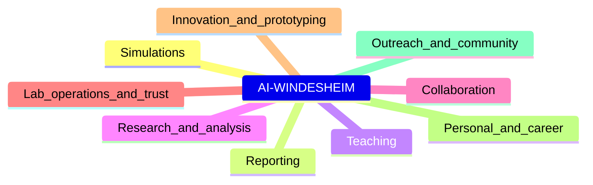

Here’s a Mermaid mind map in the structure you asked: OPENWEBUI → functionality → use case.

```mermaid
mindmap
  AI-WINDESHEIM
    Simulations
    Reporting
    Teaching
    Research_and_analysis
    Collaboration
    Lab_operations_and_trust
    Innovation_and_prototyping
    Personal_and_career
    Outreach_and_community
```
